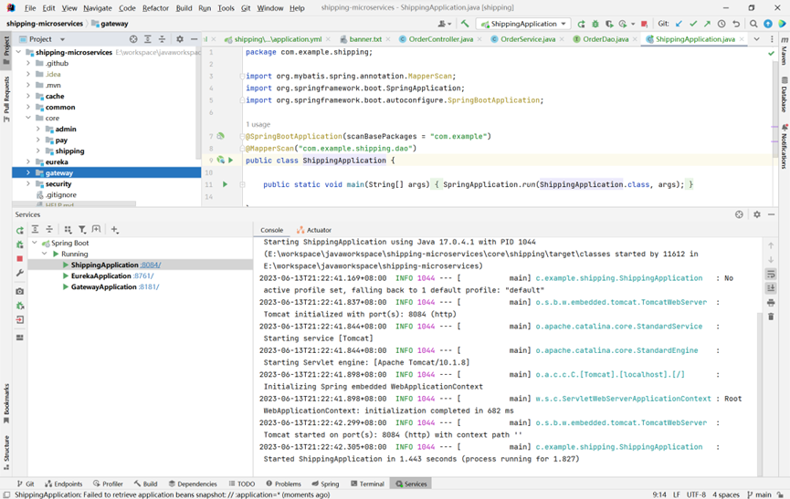

# Shipping
实训仓库地址
20301007 何军庭 这是实训作业的仓库
# 介绍
每次作业对应Homeworkx文件夹，第二次第三次作业均在Homework2-3文件夹中。
在Homework2-3中：
  demo01是前端项目，shipping是Springboot后端项目，DesignReport是项目设计报告，shipping.pdf是ApiPost7测试自动生成的测试报告。

在Homework4中，shipping-microservices是项拆分的微服务。

